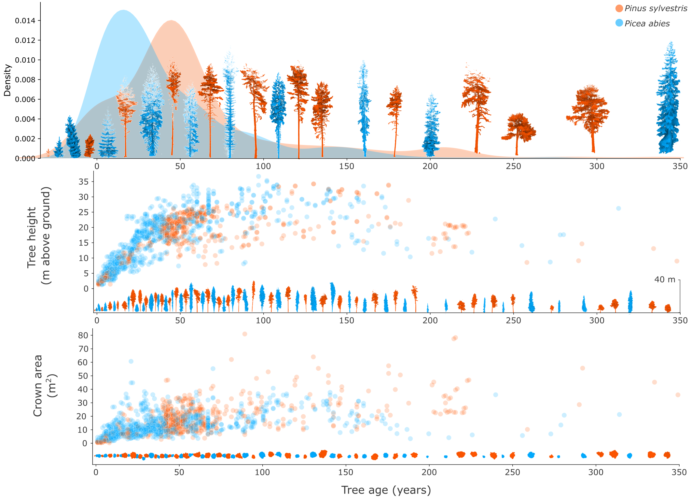

# 🌲 FOR-age: Individual Tree Age Estimation with 3D Deep Learning

This repository accompanies the **Remote Sensing of Environment** [Puliti et al. (2026) paper](https://www.sciencedirect.com/science/article/pii/S0034425726002324):

**“FOR-age: benchmarking individual tree age estimation using 3D deep learning on dense laser scanning data”**  

---

## 📊 Overview

This repository provides the **code for training and evaluation of the best-performing model** described in the paper:

> *Fine-tune ForestFormer3D*

The work introduces a novel task in forest remote sensing: estimating **individual tree age from 3D point clouds** derived from laser scanning (TLS, MLS, ALSHD).

The proposed approach leverages state-of-the-art 3D deep learning to capture fine-grained structural signals related to tree development, enabling **non-invasive and scalable age estimation**.

---

## 📈 Dataset Characteristics



*Distribution of tree age and its relationship with tree height and crown area for* *Pinus sylvestris* *and* *Picea abies*.

The dataset:
- ~1,700 tree point clouds  
- ~1,000 individual trees  
- Age range: **1 to ~350 years**  
- Species:
  - *Pinus sylvestris*
  - *Picea abies*  
- Multi-platform acquisition:
  - TLS (Terrestrial Laser Scanning)
  - MLS (Mobile Laser Scanning)
  - ALSHD (Airborne Laser Scanning)

---

## 🧠 Model

The best-performing approach is:

> *Fine-tune ForestFormer3D*

Key idea:
- Start from a **pre-trained forest panoptic segmentation model (ForestFormer3D)**
- Replace the decoder with a **regression head for tree age**
- Fine-tune the backbone to leverage learned **3D forest structural representations**

This approach achieved:
- **RMSE ≈ 21 years**
- Strong generalization across:
  - species  
  - acquisition platforms  
  - point cloud densities  

---

## 📦 Data Access

Training data is publicly available on Zenodo:

👉 https://zenodo.org/records/19853987

---

## 🧪 Evaluation / Benchmark

Evaluation on the **withheld test set** is performed through the official Codabench competition:

👉 https://www.codabench.org/profiles/user/stefanopuliti/

This ensures:
- Fair comparison  
- Standardized benchmarking  
- Reproducibility of reported results  

---

## 🚀 Repository Contents

- `train/` — training scripts for *Fine-tune ForestFormer3D*  
- `eval/` — evaluation and inference pipelines  
- `models/` — model definitions and configurations  
- `utils/` — preprocessing and data handling utilities  

---

## 🔁 Reproducibility

To reproduce the main results:

1. Download the dataset from Zenodo  
2. Preprocess data as described in the paper  
3. Train the model using provided scripts  
4. Submit predictions to Codabench for evaluation  

---

## 📜 License

- Data: see Zenodo record  
- Code: (recommended) AGPL-3.0 or GPL-3.0  
- Additional requirements may apply for derived models (see project documentation)

---

## 📚 Citation

If you use this dataset, code, or build upon this work, please cite:

```bibtex
@article{puliti2026forage,
  title={FOR-age: benchmarking individual tree age estimation using 3D deep learning on dense laser scanning data},
  author={Puliti, Stefano and Xiang, Binbin and Wielgosz, Maciej and Handegard, Eivind and Cattaneo, Nicolas and Vergarechea, Marta and Gobakken, Terje and Hyyppä, Juha and Næsset, Erik and Vastaranta, Mikko and Yrttimaa, Tuomas and Astrup, Rasmus},
  journal={Remote Sensing of Environment},
  year={2026}
}
```

---

## 📚 Funding


Funded by the European Union. Views and opinions expressed are however those of the author(s) only and do not  mnecessarily reflect those of the European Union or CBE JU. Neither the European Union nor the CBE JU can be held responsible for them.  Grant agreement N. º 101157488.
